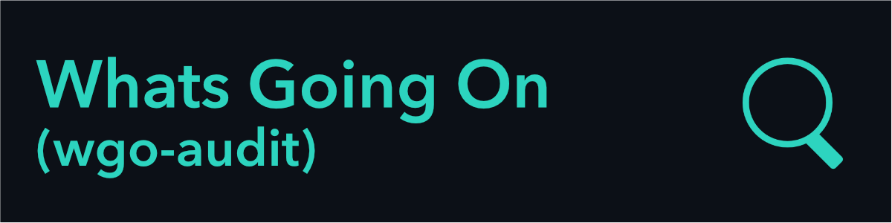
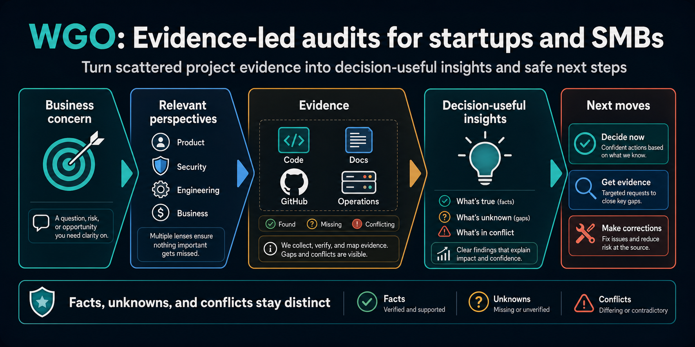

Turn code, documentation, repository history, and operational evidence into decision-useful findings and safe transition plans.

Instead of relying on guesswork or surface-level summaries, WGO maps out **facts, unknowns, and conflicts** directly from your repository history and live operational signals.

### 🔄 The Audit Process
[ Business Concern ] ➔ [ Multi-Lens View ] ➔ [ Evidence Gathering ] ➔ [ Decision-Useful Insights ] ➔ [ Next Moves ]

1. **Business Concern:** Identify high-risk areas, pending acquisitions, system transitions, or technical debt.
2. **Relevant Perspectives:** Evaluate through dedicated lenses (**Product**, **Security**, **Engineering**, and **Business**).
3. **Evidence Mapping:** Collect evidence across **Code**, **Docs**, **GitHub History**, and **Operations**.
4. **Insights Generation:** Categorize conclusions into explicit states:
   * 🟢 **Facts:** Verified through code and operational proof.
   * 🟡 **Unknowns:** Identified gaps in documentation or test coverage.
   * 🔴 **Conflicts:** Contradictory specs, stale code, or drifting architectural decisions.
5. **Next Moves:** Execute actionable, risk-aware corrections and safe transition paths.

### 📦 Main Repositories

* **[wgo-audit / whats-going-on](https://github.com/wgo-audit/whats-going-on)** — The primary core engine, audit templates, and prompts for Codex & Claude.

### 🤝 Contributing & Getting Involved

We welcome community contributions, custom audit lenses, and feedback!

* **Read the Engine Docs:** Check out [`whats-going-on`](https://github.com/wgo-audit/whats-going-on) to see how evidence runs are structured.
* **Open an Issue:** Found a bug or want to request a new audit lens? Open an issue on the main repo.
* **Join the Discussion:** Leave feedback on our architectural decision records (ADRs) or join ongoing discussions.